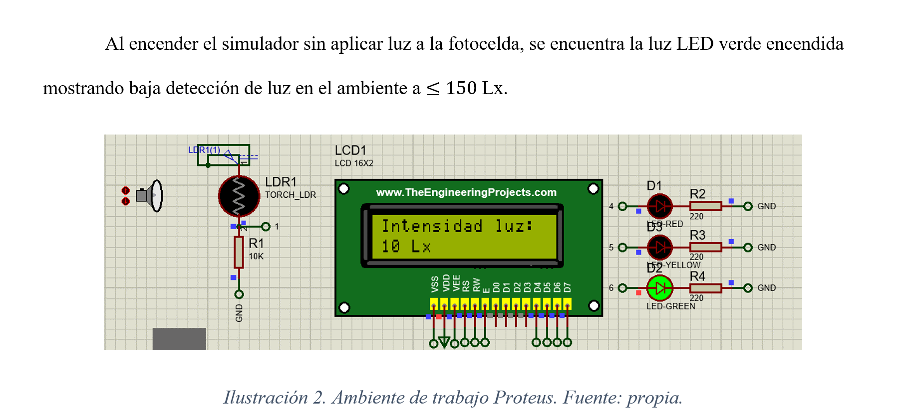

# Arduino luminancia adb
Este proyecto consiste en calcular la luminancia de la luz de cualquier ambiente.

Imágenes de muestra en Proteus:

Espero les sirva para sus proyectos. Pueden descargar, aportar mejoras en el código y divertirse. Gracias y excelente jornada.

AdB
